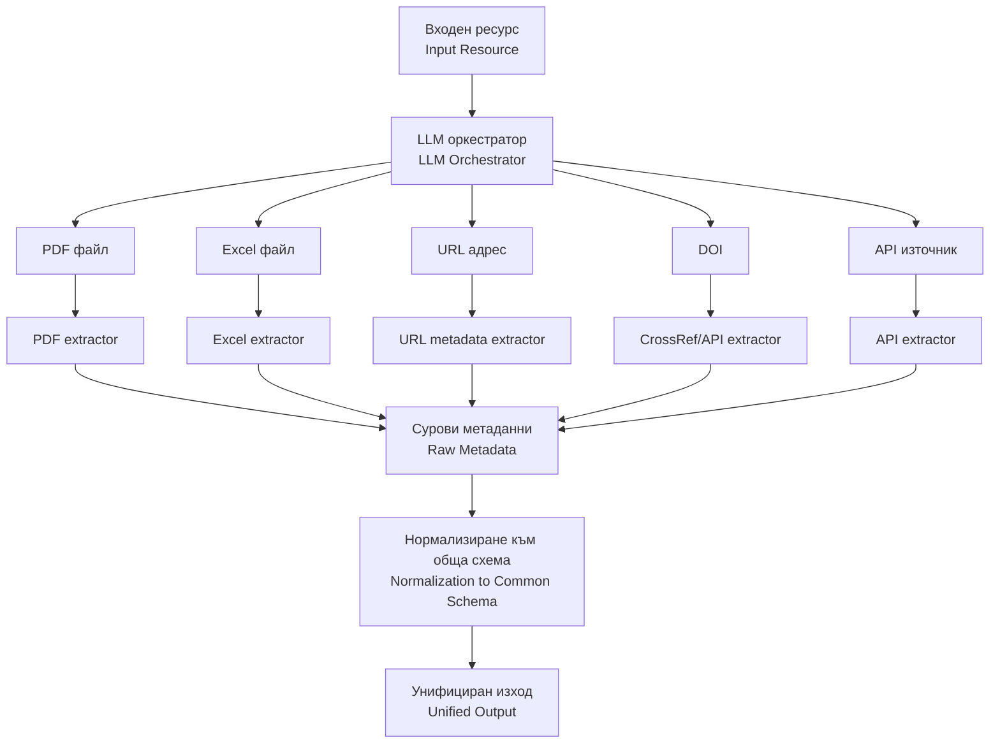

# ETMD

This is a repository containing the codebase for the metadata harvesting tool.

## Abstract Flow

### Diagram Explanation

1. **Input Resource** — The process starts with an input resource that needs metadata extraction.
2. **LLM Orchestrator** — An orchestrator analyzes the input type and routes it to the appropriate extractor.
3. **Extractors** — Depending on the resource type, one of the following extractors is used:
   - **PDF extractor** — Extracts metadata from PDF files.
   - **Excel extractor** — Extracts metadata from Excel files.
   - **URL metadata extractor** — Extracts metadata from web URLs.
   - **CrossRef/API extractor** — Retrieves metadata using DOI via CrossRef or similar APIs.
   - **API extractor** — Extracts metadata from generic API sources.
4. **Raw Metadata** — The extracted metadata is collected in its raw form.
5. **Normalization** — Raw metadata is normalized to a common schema for consistency.
6. **Unified Output** — The final result is a standardized, unified metadata output.
